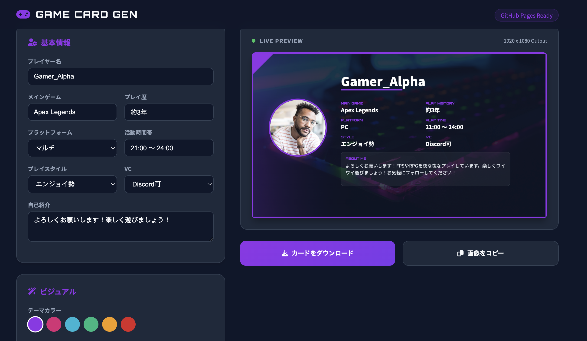

# Game Profile Card Generator

簡単・綺麗・高画質にゲームの自己紹介カードを作成できるWebアプリです。
特に「文字のズレ」を防止する独自エンジンを搭載しており、SNS投稿に最適な1920x1080サイズで出力されます。

## 🚀 アプリURL
**[https://k225t056-wq.github.io/my-app26/](https://k225t056-wq.github.io/my-app26/)**

---

## 🛠 使い方ガイド

### 1. 基本情報の入力
左側のパネルにある「基本情報」セクションに、あなたの情報を入力します。
- **プレイヤー名**: カードの中央に大きく表示される名前です。
- **メインゲーム / プレイ歴 / プラットフォーム**: あなたの活動状況を入力します。
- **VC可否 / VC方法**: ボイスチャットができるかどうか、および使用するツール（Discord, LINE等）を選択します。
- **Twitter / Discord ID**: あなたのSNSや連絡先IDを入力します。プレイヤー名のすぐ下に表示されます。
- **自己紹介**: カード下部のメッセージボックスに表示されます。長文でも自動で折り返されます。

### 2. ビジュアルのカスタマイズ
「ビジュアル」セクションで、見た目を整えます。
- **テーマカラー**: 6色のボタンから、カードの枠線やアクセントカラーを選べます。
- **アバター画像**: 「アップロード」ボタンから、自分のアイコン画像を設定できます（正方形が推奨です）。
- **背景画像**: 「アップロード」ボタンから、背景にしたい画像を設定できます（16:9の横長が推奨です）。

### 3. プレビューの確認
右側の「LIVE PREVIEW」エリアで、現在の仕上がりを確認できます。
- このプレビューは実際の出力画像と同じレイアウトで表示されます。
- 文字の重なりや画像の収まりをチェックしてください。

### 4. カードの保存・共有
完成したら、アクションボタンを使用します。
- **カードをダウンロード**: 高画質なPNG画像としてデバイスに保存します。
- **画像をコピー**: 画像をクリップボードにコピーします（対応ブラウザのみ）。そのままTwitter(X)やDiscordに貼り付け可能です。

---

## 💡 綺麗に作るコツ
- **画像サイズ**: 背景に高解像度の画像を使うと、よりプロっぽい仕上がりになります。
- **色の組み合わせ**: ゲームのイメージカラーに合わせてテーマカラーを選ぶと統一感が出ます。
- **文字量**: 自己紹介文は3〜4行程度に収めると、読みやすく美しく配置されます。

---

## ✨ 技術的な特徴
- **Canvas APIによる描画**: DOMを画像化するのではなく、Canvasに直接描画することで、ブラウザ環境に左右されない「ズレない」レイアウトを実現しています。
- **1080p出力**: 1920x1080ピクセルの固定解像度でレンダリングされます。

---

## ⚠️ 注意事項
- このアプリはブラウザ内ですべての処理を行うため、アップロードした画像がサーバーに保存されることはありません。
- 一部のブラウザ設定により、クリップボードへのコピーが制限される場合があります。その際は「ダウンロード」をご利用ください。
